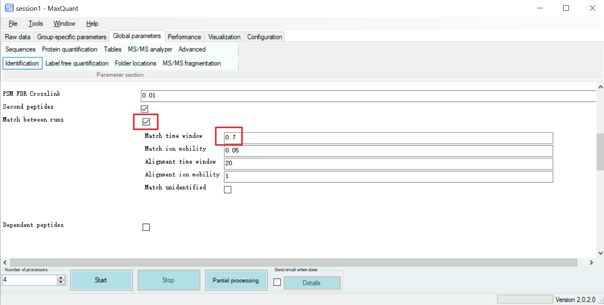
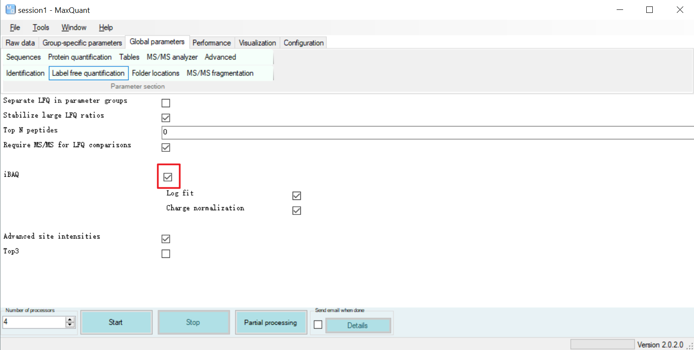
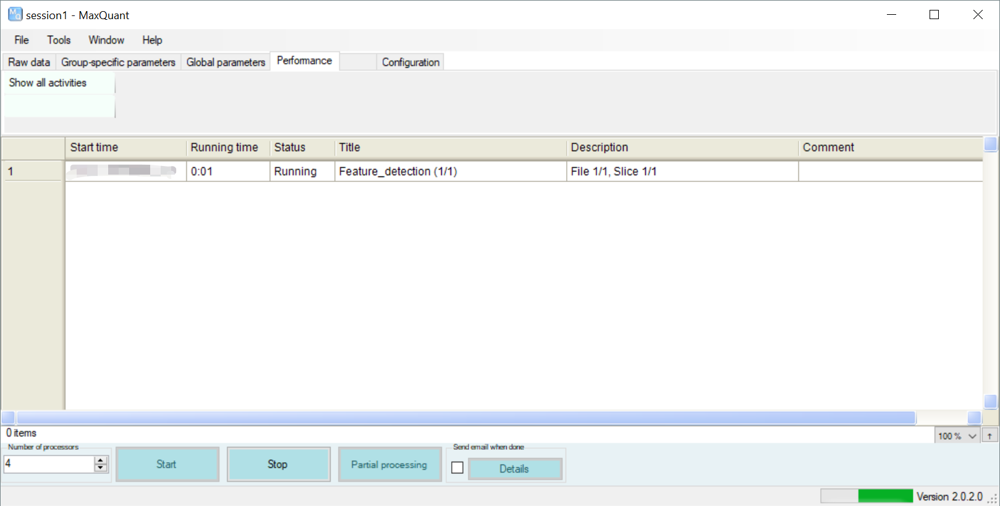

# Step 2: Look for translation evidence of backward translation proteins in mass spectrometry data.

1. **Prepare Your Data**

•	Ensure your mass spectrometry data is saved in the .raw or .d format, the primary data formats supported by MaxQuant. 

2. **Configure MaxQuant**

•	Open the MaxQuant software. You will see several tabs, with the main ones being “**Raw files**”, “**Group-specific parameters**”, “**Global parameters**”, and “**Output**”.

**Raw Files Tab:**

•	Click the “**Load**” button to select your .raw data files.

•	Click the “**Load folder**” button and select your .d data folder.

•	The data files will be added to the Raw files list, and each file will be assigned a unique experiment number.

**Group-Specific Parameters Tab:**

•	Here you can set specific parameters for different experiment groups, such as enzyme selection, fixed and variable modifications, mass spectrometer parameters, etc.

•	Common enzyme settings include Trypsin, and common variable modifications include Oxidation (M) and Acetyl (Protein N-term).

**Global Parameters Tab:**

•	Set up database search parameters: select a protein database (like UniProt) and configure parameters such as False Discovery Rate (FDR).

•	In the “**Identification**” section, you can set parameters such as the maximum number of missed cleavages.

•	In the “**Quantification**” section, you can set the labeling method (e.g., SILAC, TMT, iTRAQ).

•	“Match between runs” based on accurate m/z and retention time was enabled with a 0.7 min match time window and 20 min alignment time window.

•	Select the “**iBAQ**” option.

3. **Run MaxQuant**

•	After completing the parameter settings, click the “**Start**” button at the bottom right corner of the window to start data analysis.

•	The run time may vary depending on the size of the data and the performance of your computer.

4. **Review Results**

•	After the analysis is complete, the results files will be saved in the “**combined**” folder.

•	The main results files include proteinGroups.txt (protein group information) and peptides.txt (peptide information).

•	You can use Perseus software (a data analysis tool developed by the MaxQuant team) for further analysis of the results.

**For instructions on using MaxQuant on Linux, please refer to the official tutorial. ([https://cox-labs.github.io/coxdocs/Download_Installation.html](https://cox-labs.github.io/coxdocs/Download_Installation.html))**

